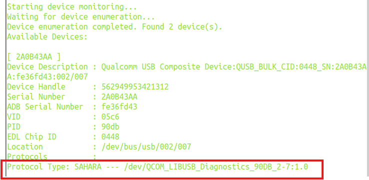
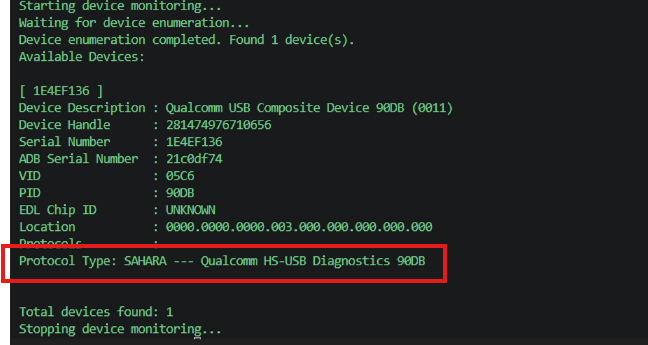
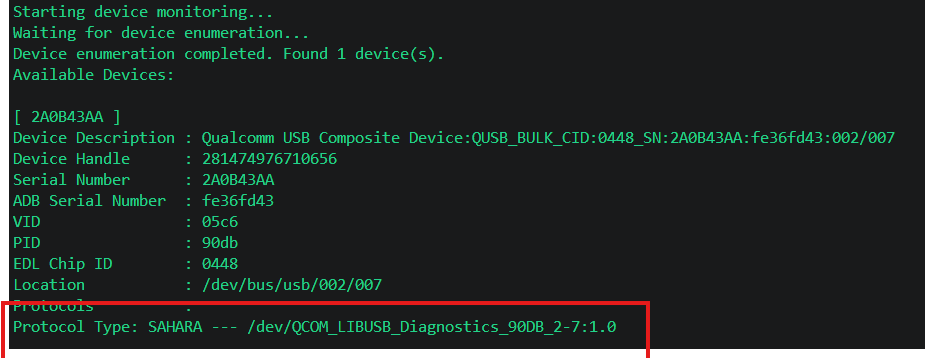

# Overview

The Qualcomm Memory Dump Collector (QMDC) is a tool for collecting memory dump files from Qualcomm-based devices.


## Open Source Repository ##

https://github.com/qualcomm/qcom-memory-dump-collector

## Distributed Components

QMDC is a zipped package with list of below component bundled:

* QMDC executable
* QMDC User Guide

## Supported Operating Systems

|OS  |  Description
|---|---|
|Linux x64 | Ubuntu 24.04 and newer|
|Windows x64 | Windows 11|
|Windows ARM64 | Windows 11|
|WSL | Ubuntu 24.04 and newer|

<a id="qmdc-setup"></a>

## Setup

1. Download the zip package for your platform from [Qualcomm Software Center (QSC)](https://softwarecenter.qualcomm.com/) – Search for “Qualcomm Memory Dump Collector”<br>
2. Unzip the downloaded zip package.<br>
3. Driver installation (optional) - QMDC requires either kernel-space or user-space Qualcomm USB drivers to communicate with devices. Driver installation is a one-time process. Choose one of the following options:<br>
   - **Kernel-space drivers (recommended):** Download and install the Qualcomm USB kernel drivers for your operating system from [GitHub releases](https://github.com/qualcomm/qcom-usb-kernel-drivers/releases).<br>
   - **User-space drivers:** Alternatively, if kernel drivers are not suitable for your environment, install the user-space drivers from [GitHub releases](https://github.com/qualcomm/qcom-usb-userspace-drivers/releases).<br>

# Usage

## Prerequisites

Before using QMDC, ensure the device is in Crash mode:

<a id="crash-mode"></a>

### Put the device in crash mode before collecting memory dump files ###

The following commands can be used to set a device to crash mode: 

`adb root` <br>
`adb wait-for-device`<br>
`adb remount`<br>
`adb wait-for-device`<br>
`adb shell "echo c > /proc/sysrq-trigger"`<br>

### Crash Mode in Linux Verification ###

If the device is in Crash mode, the output will include a line similar to:

`Protocol Type: SAHARA --- /dev/QCOM_LIBUSB_Diagnostics_90DB_2-7:1.0`

(See the screenshot below for an example.)<br>



Figure 1 - Successfully set device to Crash mode (Linux)

### Crash Mode in Windows Verification ###

If the device is in Crash mode, the output will include a line similar to:

`Protocol Type: SAHARA --- Qualcomm HS-USB Diagnostics 90DB`

(See the screenshot below for an example.)<br>


Figure 2 - Successfully set device to Crash mode (Windows)

### Crash Mode in WSL Verification ###

If the device is in Crash mode, the output will include a line similar to:

`Protocol Type: SAHARA --- /dev/QCOM_LIBUSB_Diagnostics_90DB_2-7:1.0`


(See the screenshot below for an example.)<br>

Figure 3 - Successfully set device to Crash mode (WSL)


## Run QMDC

Below is a commonly used command within QMDC; for a comprehensive list, refer to the [QMDC Commands section](#qmdc-cmds).


Collect a crash dump from a device:

`./qmdc --crash-collection --device=<DEVICE_ID> --path-name=/path/to/store/files`


## Supported Features
<a id="qmdc-cmds"></a>

### QMDC Commands

To view a list of all available commands, run ./qmdc --help or  ./qmdc -h from the command line. The following table lists all supported QMDC commands, along with a brief description of each command and its required and optional arguments. See the [QMDC Arguments section](#qmdc-args) for more information about the arguments.

<table>
<tr><th>Command</th><th>Required Arguments</th><th>Optional Arguments</th><th>Description</th></tr>
<tr><td><code>--crash-collection</code></td><td style="white-space: nowrap;"><code>--device</code><br><code>--path-name</code></td><td style="white-space: nowrap;"><code>--verbose</code></td><td>Download memory dumps from a device.</td></tr>
<tr><td><code>--help</code>, <code>-h</code></td><td style="white-space: nowrap;"></td><td style="white-space: nowrap;"></td><td>Display help information.</td></tr>
<tr><td><code>--devices</code></td><td style="white-space: nowrap;"></td><td style="white-space: nowrap;"><code>--verbose</code></td><td>List all available device identifiers.</td></tr>
<tr><td><code>--version</code></td><td style="white-space: nowrap;"></td><td style="white-space: nowrap;"></td><td>Display QMDC application version.</td></tr>
</table>

<a id="qmdc-args"></a>

### QMDC Arguments

The following table lists all available arguments, their expected values, and descriptions.

<table>
<tr><th>Option</th><th>Value</th><th>Description</th></tr>
<tr><td style="white-space: nowrap;"><code>--device</code></td><td><code>&lt;ID&gt;</code></td><td>Specify target device identifier for device operation. Use <code>SERIAL NUMBER</code> or <code>ADB Serial Number</code> or <code>Device Description</code> from <code>--devices</code> command.</td></tr>
<tr><td style="white-space: nowrap;"><code>--path-name</code></td><td><code>&lt;DIR_PATH&gt;</code></td><td>Absolute path for directory to store memory dump files.</td></tr>
<tr><td style="white-space: nowrap;"><code>--verbose</code></td><td></td><td>Enable verbose logging output. Shows detailed operation logs and debug information.</td></tr>
<tr><td style="white-space: nowrap;"><code>--port-trace</code></td><td></td><td>Enable port trace logging. Writes raw TX/RX data to port-trace files in the PtraceLogs directory for protocol-level debugging.</td></tr>
</table>

## Logs

### Debug Logs
Debug logs capture detailed information about QMDC operations and can assist in troubleshooting. They can be found in the following location:
#### Linux
`/var/tmp/QFS/QMDC/Logs/`

#### Windows
`C:\ProgramData\QFS\QMDC\Logs`

#### WSL ###
`/var/tmp/QFS/QMDC/Logs/`

### Port Trace Logs
Port Trace logs can be found in the following location:
#### Linux
`/var/tmp/QFS/QMDC/PTraceLogs/`

#### Windows
`C:\ProgramData\QFS\QMDC\PTraceLogs`

#### WSL ###
`/var/tmp/QFS/QMDC/PTraceLogs/`

## Limitations
1. **Crash Mode Required**

   All QMDC device operations require the device to be in Crash mode. If the device is not in Crash mode, commands such as `./qmdc --devices` will not detect it. See the [Crash mode](#crash-mode) section for setup instructions.

2. **Single Device at a Time**

   QMDC supports collecting memory dumps from only one device at a time. Multi-device parallel operations are not supported.

3. **ADB conflict (userspace driver only):** 
   The userspace driver has a known compatibility issue with ADB. If you are using the userspace driver, kill
   the ADB server before running the tool:
   ```bash
   adb kill-server
   ```
  If you need ADB running concurrently with crash collection, use the kernel driver instead

## FAQ

Below are some common issues and their solutions.

1. QMDC reports that the device has not been found.

   Please ensure Qualcomm Drivers have been installed. See the [Setup](#qmdc-setup) for details.

   If drivers are installed and the device is still not detected, try stopping ADB. While QMDC can run alongside ADB in most cases, stopping the ADB server may help resolve detection issues:

   `adb kill-server`